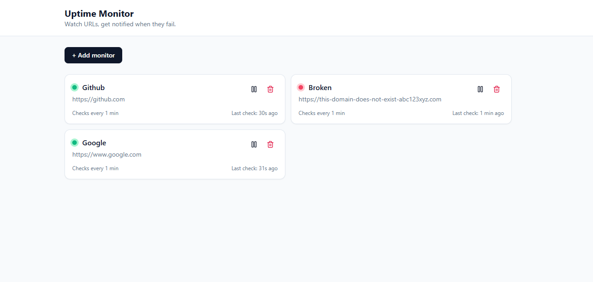
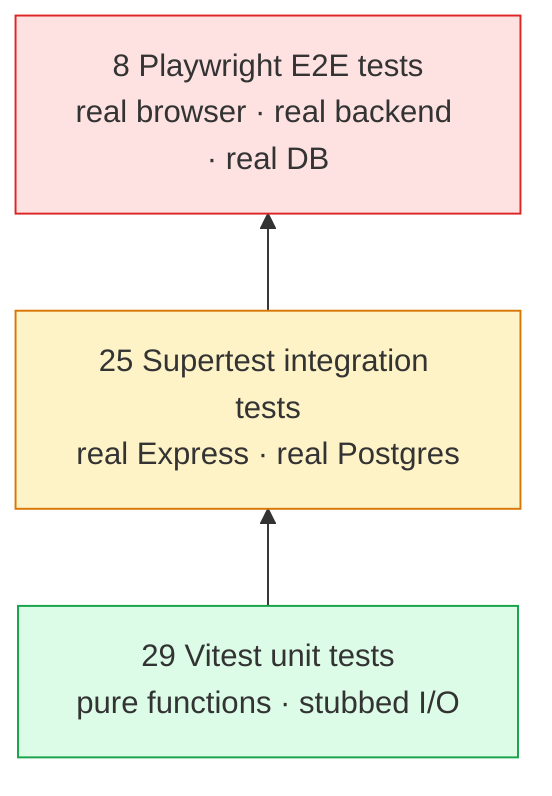

# Uptime Monitor

A self-hosted uptime monitor I built to learn full-stack development and practice writing real tests. You give it a URL, it pings it on a schedule, logs the response times, and emails you when it goes down.

[](https://github.com/Wafinator/Uptime-Monitor/actions/workflows/ci.yml)



## Why I built this

I'm a recent CS grad looking for SDET / backend roles, and I wanted a project that:
- Actually does something useful (not another todo app)
- Touches the whole stack — frontend, API, database, scheduled jobs, email
- Has a real test suite I can point to in interviews

I picked an uptime monitor because every piece of it is something I'd be expected to know on the job: scheduled work, HTTP, database persistence, email integration, and a UI.

## What it does

- Add URLs to monitor through a React dashboard
- A cron job pings them on a per-monitor interval
- Logs every check (status, response time, HTTP code) to Postgres
- Sends an email **once** when a site goes down (not every minute it stays down)
- Shows a chart of response times per monitor + a table of recent checks

A few things I made sure to get right:

- **The log insert and status update happen in one transaction**, so the dashboard can never disagree with the log table.
- **Alerts only fire on the up→down transition**, not every check while the site is down. This took me a minute to figure out but it's the right behavior.
- **The scheduler runs every minute as one tick** instead of one timer per monitor. I read that's how real schedulers work and it scales way better.

## Tech stack

**Frontend:** React, Vite, Tailwind, TanStack Query (for API calls), Recharts (for the response-time chart), lucide-react (icons)

**Backend:** Node, Express, Postgres (`pg`), node-cron, axios, nodemailer

**Testing:** Vitest (unit), Supertest (API integration), Playwright (E2E)

**Infra:** Docker Compose for local Postgres + mailhog (a fake SMTP server I use so I'm not spamming real emails in dev), GitHub Actions for CI

I picked TanStack Query over plain `useEffect + fetch` because it handles loading/error/refetch out of the box and the docs convinced me it's the standard now. Same reason I picked Vite over CRA.

## Run it locally

You'll need Docker Desktop and Node 20+.

```bash
# Spin up Postgres + mailhog
docker compose up -d

# Backend
cd backend
cp .env.example .env
npm install
npm run dev          # http://localhost:4000

# Frontend (new terminal)
cd frontend
npm install
npm run dev          # http://localhost:5173
```

Open http://localhost:5173 and add a monitor. The cron starts checking within a minute.

Mailhog's inbox is at http://localhost:8025 — alert emails land there in dev so you can see them without setting up Gmail.

## The tests

This is the part I'm proudest of. 62 tests, three layers, all running in CI on every push.



**Unit (Vitest)** — `checkService` (all the status code branches + timeouts), `alertService` (SMTP/Gmail routing, error swallowing), `isValidUrl` (the URL parser). I refactored both services to take their HTTP client / SMTP transport as parameters so the tests don't need the network. That dependency-injection trick was probably the most useful pattern I learned on this project.

**Integration (Supertest)** — full CRUD against the real Express app and a separate Postgres test database (`uptime_test`) that gets auto-created by a globalSetup hook. Tables get truncated between every test so order doesn't matter.

**E2E (Playwright)** — actual Chromium clicking buttons and filling forms. Spins up its own backend on port 4001 with the scheduler disabled (so timing isn't flaky) and its own frontend on 5174. Doesn't touch my dev environment.

Run them:

```bash
cd backend && npm test         # 54 tests, ~1 second
npx playwright test            # 8 tests, ~7 seconds (from repo root)
```

CI runs both jobs in parallel and uploads the Playwright HTML report as an artifact if anything fails.

## Project layout

```
backend/
  src/
    app.js             Express factory (separate from bootstrap so it's testable)
    index.js           Boots the server + scheduler
    db/                Pool + schema init
    routes/            Express routers
    controllers/       Request handlers + validation
    services/          checkService, alertService, scheduler
  test/                Global setup for the test DB

frontend/
  src/
    App.jsx
    components/        MonitorCard, AddMonitorForm, MonitorDetail, etc.
    lib/               api.js, formatters

e2e/                   Playwright specs
docker-compose.yml     Postgres + mailhog
playwright.config.js   Spins up isolated test backend + frontend
.github/workflows/     CI: backend tests + E2E in parallel
```

## API

```
GET    /health                          health check
GET    /api/monitors                    list all
POST   /api/monitors                    create one
GET    /api/monitors/:id                get one
PATCH  /api/monitors/:id                update fields
DELETE /api/monitors/:id                delete (logs cascade)
GET    /api/monitors/:id/logs?limit=50  recent check history
```

Quick test:

```bash
curl -X POST http://localhost:4000/api/monitors \
  -H "Content-Type: application/json" \
  -d '{"name":"GitHub","url":"https://github.com","interval_minutes":5}'
```

## Things I'd add with more time

- Auth, right now anyone hitting the page sees all the monitors
- A real job queue (BullMQ or similar) so the scheduler doesn't die if the Node process restarts
- Webhook / Slack alerts in addition to email
- Status page view to share publicly
- Migrations (currently it's just `CREATE TABLE IF NOT EXISTS` — fine for fresh installs, not great for changes later)


Built by [Wafi Hassan](https://github.com/Wafinator).
