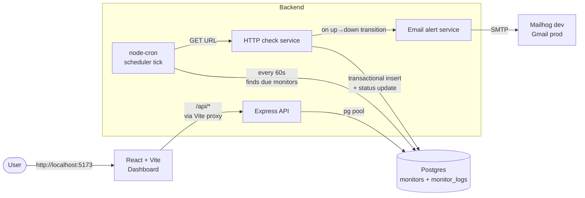
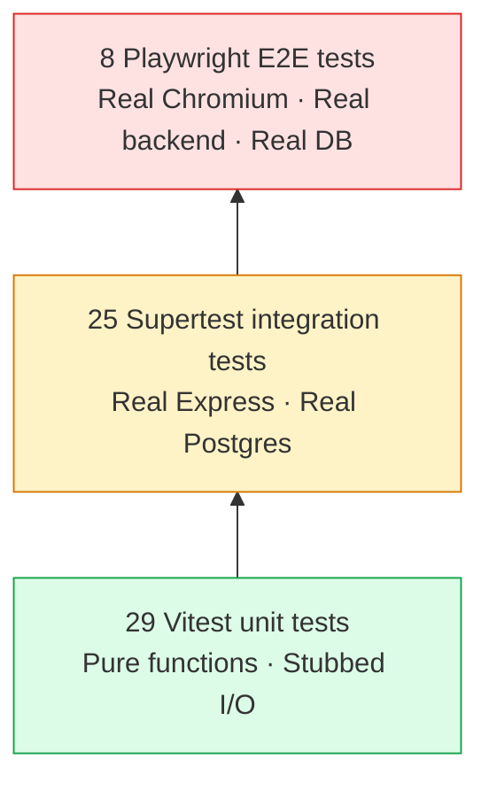

# Uptime Monitor

Self-hosted uptime monitoring for HTTP endpoints. Schedules periodic checks, logs response times, and emails you on the first failure of an outage.

[](https://github.com/Wafinator/Uptime-Monitor/actions/workflows/ci.yml)

> Built as a portfolio project to demonstrate full-stack engineering with a strong testing story (unit + integration + E2E, all running in CI).

<!-- Replace with a real screenshot once you take one. See "Screenshots" below. -->


---

## Features

- **Add, edit, pause, and delete** HTTP monitors from a React dashboard
- **Per-monitor check interval** (default 5 min, configurable per monitor)
- **Transition-based alerts** — emails on `up → down` only, no repeat spam during an outage
- **Response-time history** charted per monitor (last 50 checks)
- **Live dashboard** — auto-refreshes every 15s without a page reload
- **Graceful degradation** — works with no email configured, no alerts, no errors

---

## Architecture



**Key design decisions:**

- **In-process cron** (`node-cron`) instead of a separate job queue. Simpler for a portfolio; trade-off noted in [Production tradeoffs](#production-tradeoffs).
- **Transactional check writes** — `INSERT log` + `UPDATE monitor.last_status` commit together so the dashboard can never disagree with the log table.
- **Per-monitor due-time** — the scheduler ticks every minute but each monitor has its own `interval_minutes` and is only checked when due. Lets one process handle thousands of monitors cleanly.
- **Concurrency cap** — `MAX_CONCURRENT_CHECKS = 25` per tick prevents a flood of due monitors from drowning the DB pool.

---

## Tech stack

| Layer | Choice | Why |
|---|---|---|
| Frontend | React 18 + Vite | Fast HMR, zero config |
| Frontend styling | Tailwind CSS | Looks professional out of the box |
| Server-state | TanStack Query | Removes useState/useEffect boilerplate, handles caching + refetch |
| Charts | Recharts | Declarative React, easy to test |
| Icons | lucide-react | Tree-shaken SVG icons |
| Backend | Node + Express 5 | Industry standard, minimal magic |
| Database | Postgres 16 | Real RDBMS, indexed log queries |
| Scheduling | node-cron | In-process cron, no separate worker |
| HTTP checks | axios | Configurable timeout + redirect handling |
| Email | nodemailer | SMTP + Gmail support behind one API |
| Dev SMTP | mailhog (Docker) | Catch alert emails locally without real credentials |
| Unit tests | Vitest | Vite-native, fast, great DX |
| API tests | Supertest | Hits Express without a network |
| E2E tests | Playwright | Real Chromium, parallel-safe, CI-friendly |
| CI | GitHub Actions | Free for public repos, easy Postgres service container |

---

## Run it locally

**Prereqs:** Docker Desktop, Node 20+, npm.

```bash
# 1. Start the dev dependencies (Postgres + mailhog)
docker compose up -d

# 2. Backend
cd backend
cp .env.example .env
npm install
npm run dev          # http://localhost:4000

# 3. Frontend (new terminal)
cd frontend
npm install
npm run dev          # http://localhost:5173
```

Visit **http://localhost:5173** and add a monitor. The cron will start checking it within ~60 seconds.

**View caught alert emails** at **http://localhost:8025** (mailhog's web UI).

---

## Testing

This project has a **full test pyramid** — 62 tests across three layers, all running in CI on every push.



### Unit tests (Vitest)

- `checkService` — 2xx/3xx/4xx/5xx classification, timeouts, headers, validateStatus contract
- `alertService` — SMTP vs Gmail routing, transporter caching, error swallowing, fallback from-address
- `isValidUrl` — http/https accepted, ftp/file/garbage rejected

```bash
cd backend && npm test
```

### Integration tests (Supertest)

- Full CRUD on `/api/monitors`
- Validation errors (400s) for bad input
- `ON DELETE CASCADE` actually removes child logs
- Logs endpoint pagination + ordering

A **separate test database** (`uptime_test`) is auto-provisioned by `globalSetup` so tests can run alongside the dev server without touching dev data. Tables are truncated between every test for order independence.

### E2E tests (Playwright)

- Add / list / pause / delete flows in real Chromium
- Form validation surfacing backend errors
- Modal detail view rendering

Playwright spins up:
- A **dedicated test backend** on `:4001` with `DISABLE_SCHEDULER=1` (deterministic — no real HTTP checks fire mid-test)
- A **dedicated test frontend** on `:5174` with its proxy pointed at the test backend

```bash
# From repo root
npm install
npx playwright install chromium
npx playwright test
```

On CI failure, the HTML report is uploaded as an artifact with screenshots + traces.

---

## Project structure

```
.
├── backend/                 # Express + Postgres + node-cron
│   ├── src/
│   │   ├── app.js           # Express factory (no side effects — testable)
│   │   ├── index.js         # Bootstrap: initDb, scheduler, server, shutdown
│   │   ├── db/              # Pool + schema init
│   │   ├── routes/          # Express routers
│   │   ├── controllers/     # Request handlers + input validation
│   │   └── services/        # checkService, alertService, scheduler
│   └── test/                # globalSetup + setupFiles for integration tests
│
├── frontend/                # React + Vite + Tailwind
│   └── src/
│       ├── App.jsx
│       ├── components/      # MonitorCard, MonitorList, MonitorDetail, ...
│       └── lib/             # api.js (fetch wrapper), format.js
│
├── e2e/                     # Playwright specs
├── docker-compose.yml       # Postgres + mailhog dev services
├── playwright.config.js     # webServer config spins up test backend + frontend
└── .github/workflows/ci.yml # Two parallel jobs: backend tests, E2E tests
```

---

## API

```
GET    /health                          { ok: true }
GET    /api/monitors                    list all monitors
POST   /api/monitors                    create a monitor
GET    /api/monitors/:id                get one
PATCH  /api/monitors/:id                partial update
DELETE /api/monitors/:id                delete (cascades to logs)
GET    /api/monitors/:id/logs?limit=50  recent check history (max 500)
```

Example:

```bash
curl -X POST http://localhost:4000/api/monitors \
  -H "Content-Type: application/json" \
  -d '{
    "name": "GitHub",
    "url": "https://github.com",
    "interval_minutes": 5,
    "alert_email": "you@example.com"
  }'
```

---

## Production tradeoffs

A few honest notes on what would change if this were going to production:

- **In-process cron** would become a job queue (BullMQ + Redis) or a dedicated worker process. The current setup dies if the Node process dies — fine for a single-tenant portfolio app, not fine for paying customers.
- **Single DB pool** would become a connection pool per service + a read replica for the dashboard's log queries.
- **Polling** would be supplemented with **circuit breakers** so a continuously failing target doesn't burn HTTP requests forever.
- **Email-only alerts** would gain webhook / Slack / PagerDuty escalation.
- **Schema migrations** would use a real migration tool (Drizzle, Knex) instead of `CREATE TABLE IF NOT EXISTS`. Fine for a fresh install; doesn't handle schema evolution.
- **Auth** doesn't exist — every visitor sees every monitor. Would add session-based auth + per-user data partitioning.
- **Observability** would gain Prometheus metrics + structured JSON logs (pino) so dashboards and alerts can be built off the monitor itself.

These omissions are deliberate scope cuts to keep the project shippable as a portfolio piece, not gaps from missing knowledge.

---

## Screenshots

Drop a screenshot of the running app at `docs/screenshot-dashboard.png` to populate the image above.

A quick way:
1. Start backend + frontend, add 2-3 monitors (one good URL, one bad)
2. Wait ~1 min for the first checks to land
3. Hit your OS screenshot shortcut, save to `docs/screenshot-dashboard.png`

---

## License

MIT
